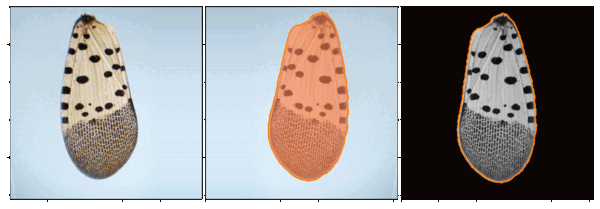
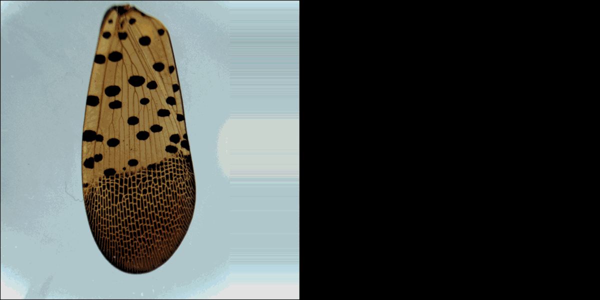
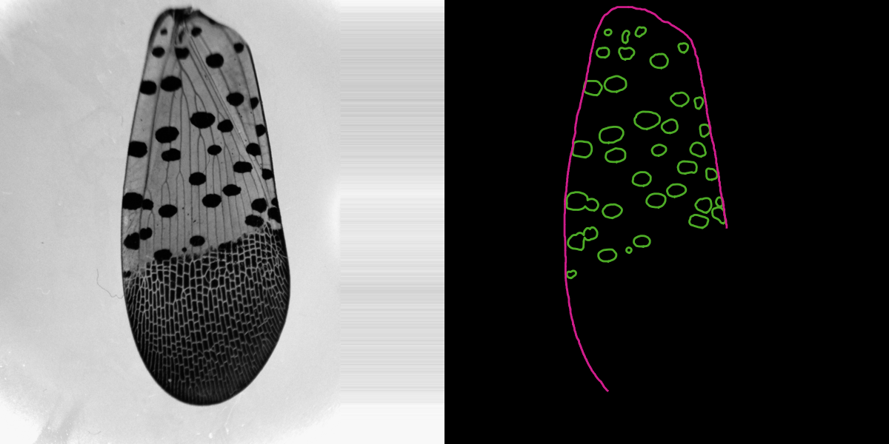

# HOPPERSCAPES


> ** demo alpha - July 2025 **

<p align='center'>Mapping and representation learning of forewing morphology and patterning in planthoppers</p>

## Overview

Planthoppers have evolved intricate and diverse forewing compositions. [HopperScapes](https://github.com/sassanostvar/hopperscapes) applies representation learning to the underlying _morpho-chromospace_, toward understanding tegminal material ecologies in terms of shared developmental roots and fundamental biophysical principles.

This growing repository compiles a toolset for quantitative analysis of light microscopy and photographic images of tegmina, including utilities for dataset management, image processing, semantic segmentation, morphometry, and reconstruction.

## Repository Structure
This repository is organized as follows:

    .
    ├── hopperscapes
    │   ├── data
    │   ├── imageproc
    │   ├── segmentation
    │   └── morphometry
    │
    ├── assets
    ├── checkpoints
    ├── configs
    ├── docs
    ├── notebooks
    ├── scripts
    └── tests

Each module's components, functions, and implementation choices are outlined in the respective READMEs:

- `hopperscapes.data`
- `hopperscapes.imageproc`
- [`hopperscapes.segmentation`](./hopperscapes/segmentation)
- `hopperscapes.morphometry`

## Installation
To install the package, create a new Python environment and clone the repository.

```bash
$ cd $HOPPERSCAPES_ROOT
$ python -m pip install -r requirements.txt
$ python -m pip install -e .
```
Note: The project is currently under active development; the API may change.

## Dependencies
The core functionality relies on **PyTorch**, **torchvision**, **scikit-image**, **Pillow**, **zarr/ome-zarr**, **Dask**, and **NetworkX**.

See [requirements.txt](requirements.txt) for the full list.

## Data
Data curation for the project is ongoing. Part of the effort is focused on sampling established Northeast populations of _L. delicatula_. Locally sourced specimens are imaged using transmitted light microscopy. Specimen collection and imaging metadata are recorded and organized as specified in [hopperscapes.data.record.py](./hopperscapes/data/record.py).

<p align="center"><br>segmentation and alignment of light microscopy data</p>


## Dataset structure
Light microscopy data are organized using [ome-zarr](https://github.com/ome/ome-zarr-py) according to the specifications in [hopperscapes/data/zarr_store.py](hopperscapes/data/zarr_store.py):

    dataset.zarr/
    └─ specimenID/                
        └─ forewing/
            ├─ left/                  
            │   ├─ rgb/         
            │   │   │─ 0        # (3×H×W)   
            │   │   │─ 1          
            │   │   ...                       
            │   └─ .attrs
            └─ right/
                ├─ rgb/         
                │   │─ 0        # (3×H×W)   
                │   │─ 1          
                │   ...                
                └─ .attrs

This structure is expanded to incorporate segmentations, reconstructions, and other derived representations.

## Data Sources
Local sources of _L. delicatula_ specimens include Morningside Heights (New York City) and Hudson River Valley (New York). Web sources of the cross-species dataset include Wikimedia Commons, iNaturalist, and FLOW Hemiptera database.

## Sample Workflows

For a minimal demo of the segmentation model, see [notebooks/demo_pretrained_unet.ipynb](notebooks/demo_pretrained_unet.ipynb).

The core segmentation, image processing, and morphometry modules can be chained into standardized pipelines for object detection and morphometry.

<p align="center"><br>A sample object detection and morphometry pipeline to study the spots pattern</p>

<p align="center"><br>A sample reconstruction pipeline for the venation network</p>


## Status & Roadmap

We are developing the project in public. We reached the 1,500 specimen mark in 2024, and 200 specimens (400 samples) have been imaged as of Q1 2025. Release of the first _L. delicatula_ light microscopy dataset, along with proofread segmentations and model checkpoints, is expected in Q3 2025.

For more details on the project roadmap, please visit [STATUS.md](STATUS.md).

## Acknowledgements
We thank Columbia University Public Safety and members of the Mechanical Engineering Graduate Association (MEGA) for assistance during sample collection. HopperScapes is designed and maintained by **Sassan Ostvar**.

## Citation
_forthcoming_

## Contact
Contributions and collaborations are most welcome. Please contact [Sassan Ostvar](https://sassanostvar.github.io).

## Related Work
- Ronellenfitsch, Henrik, Jana Lasser, Douglas C. Daly, and Eleni Katifori. "Topological phenotypes constitute a new dimension in the phenotypic space of leaf venation networks." PLoS computational biology 11, no. 12 (2015): e1004680. [https://doi.org/10.1371/journal.pcbi.1004680](https://doi.org/10.1371/journal.pcbi.1004680)
- Hoffmann, Jordan, Seth Donoughe, Kathy Li, Mary K. Salcedo, and Chris H. Rycroft. "A simple developmental model recapitulates complex insect wing venation patterns." Proceedings of the National Academy of Sciences 115, no. 40 (2018): 9905-9910. [https://doi.org/10.1073/pnas.1721248115](https://doi.org/10.1073/pnas.1721248115)
- Katifori, Eleni. "The transport network of a leaf." Comptes Rendus. Physique 19, no. 4 (2018): 244-252.
- Salcedo, Mary K., Jordan Hoffmann, Seth Donoughe, and L. Mahadevan. "Computational analysis of size, shape and structure of insect wings." Biology Open 8, no. 10 (2019): bio040774. [https://doi.org/10.1242/bio.040774](https://doi.org/10.1242/bio.040774)
- Lürig, Moritz D., Seth Donoughe, Erik I. Svensson, Arthur Porto, and Masahito Tsuboi. "Computer vision, machine learning, and the promise of phenomics in ecology and evolutionary biology." Frontiers in Ecology and Evolution 9 (2021): 642774. [https://doi.org/10.3389/fevo.2021.642774](https://doi.org/10.3389/fevo.2021.642774)
