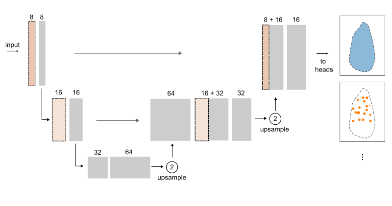
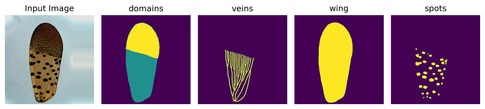
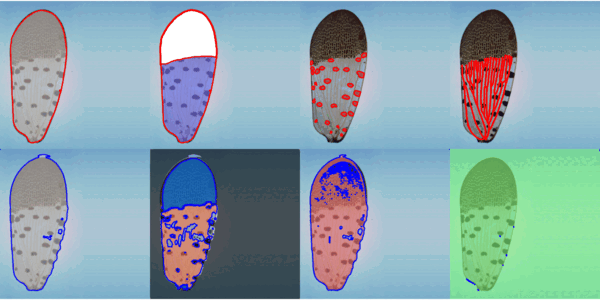

# Segmentation

Quantitative analysis of wing morphology and patterning requires accurate localization of features of interest in imaging data. 
We frame this as a **multi-task semantic segmentation** problem. 

Depending on the species, some features, like the wing outline, spots, and pigmentation domains, are often straightforward to segment. Other features, like the venation network, can be challenging to segment when sample illumination is not optimal and the venation network is occluded by other features. 

Here, we adopt a multi-step, multi-resolution approach to the segmentation problem, using UNet variants, as outlined below.

## Table of Contents
- [First-pass Multi-task Semantic Segmentation](#first-pass-multi-task-semantic-segmentation)
    - [Network Architecture](#network-architecture)
    - [Loss Function](#loss-function)
    - [Training Dynamics](#training-dynamics)
    - [Performance](#performance)
    - [Usage](#usage)
        - [Datasets](#datasets)
        - [Data Augmentation](#data-augmentation)
        - [Training](#training)
        - [Inference](#inference)

## First-pass Multi-task Semantic Segmentation
### Network Architecture
We start with compact, multi-head U-Nets (~ 80-200k parameters) whose heads share a single encoder-decoder, targeting coarse morphological features. Training uses padded, down-sampled images (512x512 or 1024x1024).

<p align="center"><br>Highly compact **ModularHopperNet** used in preprocessing
</p>

The configurable multi-head architecture provides flexibility to experiment with feature sets across species.

The model is trained on manual segmentations of (1) wing outlines/areas, (2) spots, (3) pigmentation domains, and (4) venation networks in _L. delicatula_ tegmina. 

<p align="center"></p>


The compact model provides the initial feature masks for preprocessing and dataset standardization.


### Loss Function
The composite loss is defined in [`loss.py`](../segmentation/loss.py) and configured in [`configs.py`](../configs.py) or YAML files in [`/configs`](../../configs). The loss function is configured to accommodate task-specific mask morphologies and class imbalance. For instance, we use binary cross-entropy (BCE) and soft Dice loss for wings, focal loss and soft Dice loss for spots, and a combination of BCE, soft Dice, and (soft) clDice for veins: 
- wing: bce + soft_dice
- spots: focal + soft_dice
- veins: bce + soft_dice + clDice
- domains: ce (+ soft_dice)

We use the cross-entropy loss for multi-class tasks like pigmentation domains.

The loss function can be configured as follows:

```yaml
# example loss function configs
loss_function_configs:
  wing:
    bce:
      weight: 1.0
      params:
        pos_weight: 5.0
    soft_dice:
      weight: 1.0
      params: {}
  veins:
    bce:
      weight: 0.5
      params:
        pos_weight: 100.0
    soft_dice:
      weight: 2.0
      params: {}
    cldice:
      weight: 2.0
      params: {}
  spots:
    focal:
      weight: 1.0
      params:
        alpha: 0.85
        gamma: 2.0
    soft_dice:
      weight: 1.0
      params: {}
  domains:
    ce:
      weight: 1.0
      params: {}
```
Full files in: [`/configs`](../../configs).

### Training Dynamics
We use gradient clipping to promote stable early training. We also dynamically freeze and unfreeze the heads, based on preset Dice score thresholds, to ensure all task-specific heads receive sufficient gradients. 

### Performance
In practice, the wing outline and pigmentation domain Dice scores saturate quickly, followed by the spots.

<p align="center"></p>

The compact network trained on downsampled images struggles with the intricate venation network, which is occluded and lower in contrast than the other features. Addressing this limitation motivates the next model design and training iterations.

## Usage

### Datasets
Custom PyTorch `Dataset` classes and collate functions are defined in [`dataset.py`](../segmentation/dataset.py).

The model can ingest data arranged as: 

    └── root
        └── train
            ├── images
            │   └── <record_id>.jpg
            └── masks
                ├── domains
                │   └── <record_id>_seg_domains.tif
                ├── spots
                │   └── <record_id>_seg_spots.tif
                ├── veins
                │   └── <record_id>_seg_veins.tif
                └── wing
                    └── <record_id>_seg_wing.tif

**Experimental:** stream images from an OME-Zarr store (see [`data/zarr_store.py`](../data/zarr_store.py) and `HopperZarrDataset`).

### Data Augmentation
Basic data augmentation utilities are included in [`segmentation/augment/`](../segmentation/augment/). Use the `augment` command-line interface to create augmented datasets locally:

```bash
$ python -m pip install -e .
$ python -m hopperscapes.segmentation.augment \
--images_dir $PATH_TO_IMAGES \
--masks_dir $PATH_TO_MASKS \
--savedir $PATH_TO_SAVE_AUGMENTED_SET
```

### Training
Train the model in a notebook or using the `train` command-line interface:

```bash
$ python -m pip install -e .
$ python -m hopperscapes.segmentation.train \
--configs_path $PATH_TO_CONFIGS_YAML \
--images_dir $PATH_TO_IMAGES \
--masks_dir $PATH_TO_MASKS \
--checkpoint_path $PATH_TO_PRETRAINED_CHECKPOINT
```
*(Upcoming: full mask support for end-to-end OME-Zarr training.)*

### Inference
Apply a trained checkpoint to an image using the `infer` command-line interface:

```bash
$ python -m pip install -e .
$ python -m hopperscapes.segmentation.infer \
--image_path $PATH_TO_IMAGE \
--checkpoint_path $PATH_TO_CHECKPOINT \
--device "cpu"
```
